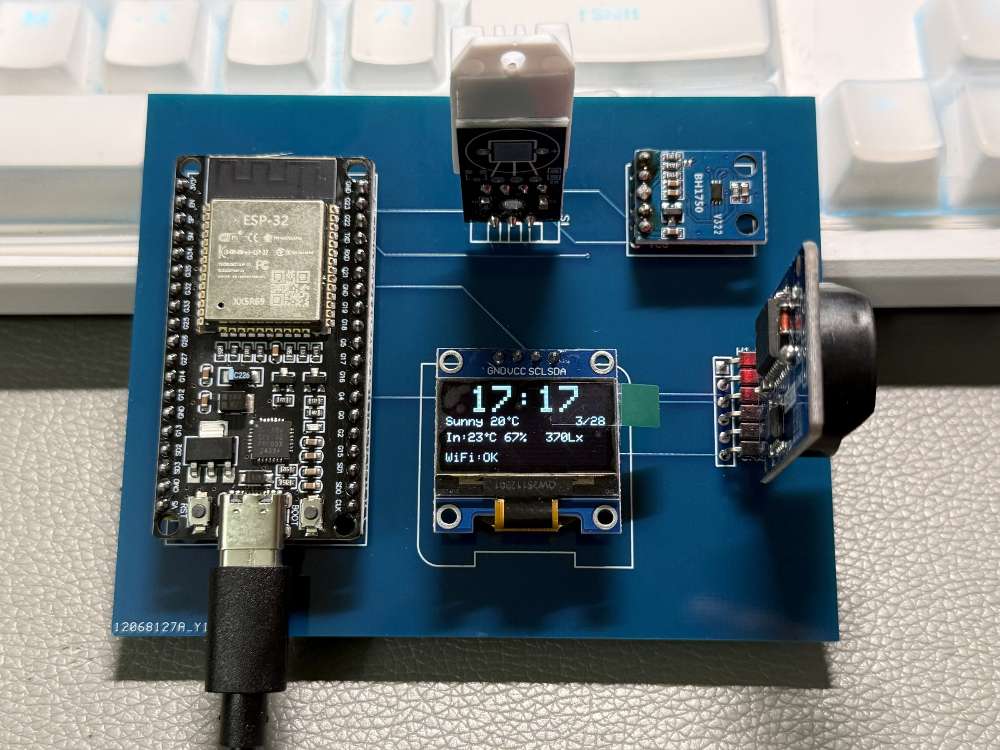

# ESP32 天气时钟

> **教学原型 / 历史项目。** 基于 ESP32、DHT22、BH1750、DS3231、SSD1306 OLED、Wi-Fi AP 配网与和风天气 API 的桌面天气时钟。

它演示一条小型嵌入式原型链路：读取本地温湿度、光照和 RTC；在有网络和用户自备凭据时请求天气数据；将当前源码中的字段绘制到 OLED。它不是气象服务、计量仪表、网络安全产品或可直接长期部署的成品。

## 历史素材证据（2026-07-18 发布）

已脱敏的历史照片和历史 EDA 衍生文件。日期、脱敏处理、未公开材料和证据边界见 [MEDIA_EVIDENCE](docs/MEDIA_EVIDENCE.md)。



历史照片、截图或 EDA 不证明当前公开提交已烧录或完成真机复测。**当前未进行真机复测。**


## 当前状态与证据边界

| 层级 | 当前事实 |
| :-- | :-- |
| 源码来源 | 桌面原工程与历史 ZIP 的 4 个有效文件逐文件比对一致；原工程和 ZIP 均保持只读。 |
| 公开净化 | 已移除原始 API Key 与固定 AP 密码；公开候选不提交 `weather_clock_config.h`，并禁止凭据回显和敏感串口日志。 |
| 固件构建 | 已验证。2026-07-17 的隔离一键门禁在当前候选内容上通过；PlatformIO 结果见下一行。 |
| 当前真机复测 | **未执行。** 当前公开候选尚未重新烧录、配网或联调 ESP32、DHT22、BH1750、DS3231、OLED、Wi-Fi、NTP、EEPROM 与天气 API。 |
| 实物与 EDA | 当前未公开实物照片、演示视频、原理图、PCB、Gerber 或制造文件。 |

因此，本仓库只适合作为**源码阅读、构建和受控复现**的参考。构建成功不证明传感器准确、天气数据可用、时间正确、设备联网、安全或长期稳定。

## 源码功能范围

```text
DHT22 ─────┐
BH1750 ────┼─ I2C / GPIO ── ESP32 ── SSD1306 OLED
DS3231 ────┘                  │
                               ├─ EEPROM：本地配置（非安全存储）
                               ├─ AP Captive Portal：短时本地配置
                               ├─ STA + NTP：时钟同步
                               └─ HTTPS 请求：和风天气当前天气接口
```

- 从 DHT22 读取温度、湿度；从 BH1750 读取光照；从 DS3231 读取时间；
- 使用 SSD1306 显示时钟、日期、当前天气字段、室内温湿度、光照和 Wi-Fi 标志；
- 首次没有可用 Wi-Fi，或连续重连失败后，创建本地 AP 配网页；
- 用户在本地页面输入 Wi-Fi、和风天气 Key 与城市 ID，固件写入 EEPROM 后重启；
- 网络可用时请求天气数据；源码当前用 gzip 解压与 JSON 解析处理响应。

上述均为**当前源码行为**，不是当前设备的实时或已复测状态。

## 接线与硬件边界

| 模块 | ESP32 接口 | 当前源码配置 | 注意事项 |
| :-- | :-- | :-- | :-- |
| DHT22 | GPIO4 | `DHT_PIN=4` | 传感器型号、上拉、供电、精度和实际读数均待复测。 |
| SSD1306 OLED | SDA=GPIO21、SCL=GPIO22 | I2C 地址 `0x3C` | 当前代码初始化失败会停止运行；实际屏幕地址和电压须以实物为准。 |
| BH1750 | SDA=GPIO21、SCL=GPIO22 | I2C 地址 `0x23` | 与 OLED、DS3231 共用 I2C；总线拉高与地址冲突待实物确认。 |
| DS3231 RTC | SDA=GPIO21、SCL=GPIO22 | I2C 地址 `0x68` | RTC 电池、时区、失电路径和准确度未按公开提交复测。 |
| USB 串口 | 取决于开发板 | `115200` | 开发板型号、Flash、USB 芯片与稳定供电未确认。 |

完整清单和边界见 [HARDWARE.md](HARDWARE.md)。`hardware/wiring-diagram.svg` 是按源码推导的接口图，**不是**原理图、PCB、实测接线或电气认证。

请先确认所有模块的电压、电平、共地、上拉/限流和开发板资料。不要将 5 V 信号直接接入 ESP32 GPIO，也不要把此教学原型连接到市电、大功率或安全关键设备。

## 本地配置与网络安全

没有可用 STA 配置时，固件会启动：

```text
SSID: WeatherClock-Setup
Password: none (open AP)
Config URL: http://192.168.4.1/
```

开放 AP 是为了避免把固定密码伪装为安全机制；它只适合短时间、隔离、可信的本地配置环境。页面和 `/scan`、`/save` 都是无认证、无 TLS 的 HTTP。`/scan` 会返回附近 Wi-Fi 名称和信号信息；`/save` 会接收 Wi-Fi 密码和天气 API Key 并写入 EEPROM。

天气请求虽使用 HTTPS，但当前源码调用 `WiFiClientSecure::setInsecure()`，**不校验服务器证书**。EEPROM 也不是安全凭据存储。不要把设备、开放 AP 或 HTTP 接口暴露到公网、不可信网络或包含真实敏感数据的环境。

配置页不会回显已保存的 Wi-Fi 或 API Key；串口日志也不输出这些字段或天气响应内容。但设备本地仍会保存凭据：不要公开 EEPROM 导出、串口记录、照片、视频、截图、SSID、密码、API Key、私网地址、MAC 或网络拓扑。

完整接口与边界见 [docs/PROTOCOL.md](docs/PROTOCOL.md) 和 [SECURITY.md](SECURITY.md)。

## 构建

### 1. 准备本地配置（可选）

仓库自带安全的 `firmware/include/weather_clock_config.example.h`，空值会让设备走本地配置流程。若想在本地预置自己的测试配置：

```bash
cd firmware/include
cp weather_clock_config.example.h weather_clock_config.h
# 仅在本机填写自己的测试值；不要提交 weather_clock_config.h。
```

### 2. 编译固件

```bash
cd firmware
pio run
```

已固定的构建目标为 `PlatformIO Core 6.1.19`、`espressif32@6.13.0` 和 `esp32dev`。2026-07-17 的隔离一键门禁在当前候选内容上构建通过：RAM `47488 / 327680`（14.5%）、Flash `1036681 / 1310720`（79.1%）。这仍不是烧录或真机验证；Flash 占用较高，烧录前应按你的精确开发板重新确认可用空间。

### 一键门禁

```bash
bash scripts/verify.sh
```

脚本会将当前候选导出到临时目录，运行敏感信息/仓库结构检查、无硬件源码契约测试和 PlatformIO 构建；不会修改权威来源，不会烧录设备、连接真实 Wi-Fi、调用真实天气 API、写入真实凭据或证明真机行为。

## 真机复测前必须完成

请按 [docs/VERIFICATION.md](docs/VERIFICATION.md) 记录日期、完整 Git commit、精确板型和每项通过/失败/未测。其中至少包括：

1. ESP32 板型、供电、Flash、USB 芯片及当前提交烧录；
2. DHT22、BH1750、DS3231、OLED 的实际型号、电压、共地、I2C 地址和初始化/错误路径；
3. 无保存凭据时的开放 AP、`http://192.168.4.1/`、Wi-Fi 扫描、配置保存和重启；
4. STA、断网重连、NTP 成功/失败、RTC 失电和显示刷新；
5. 受控测试天气 API 请求、`setInsecure()` 风险、错误响应、gzip 与 JSON 解析；
6. 30–60 分钟稳定性、Flash 空间、内存、传感器偏差与显示结果；
7. 实物媒体与日志的密钥、SSID、密码、私网、设备标识、EXIF/GPS 脱敏。

完成可审计复测前，不要宣称“设备在线”“天气准确”“传感器已验证”“稳定运行”“安全连接”或“生产就绪”。

## 许可证、第三方与学习使用

- Rongyi 原创的固件、文档和源码推导图以 [MIT License](LICENSE) 公开；
- 依赖清单及其各自许可责任见 [THIRD_PARTY_NOTICES.md](THIRD_PARTY_NOTICES.md)；
- 本项目用于学习、实验、课程参考和二次开发。请保留来源说明，不要将其直接包装为个人课程设计、毕业设计、竞赛或商业产品成果；
- 使用者自行承担硬件、电气、网络、天气数据、密钥和适用性验证责任。

## 更多资料

- [项目状态](docs/PROJECT_STATUS.md)
- [来源与权威副本裁决](docs/SOURCE_PROVENANCE.md)
- [配网与协议说明](docs/PROTOCOL.md)
- [验证说明](docs/VERIFICATION.md)
- [GitHub 元数据](docs/GITHUB_METADATA.md)
- [Hardware Lab 索引卡片](docs/HARDWARE_LAB_CARD.md)
- [Hardware Lab](https://github.com/rongyishuaige7/hardware-lab)
